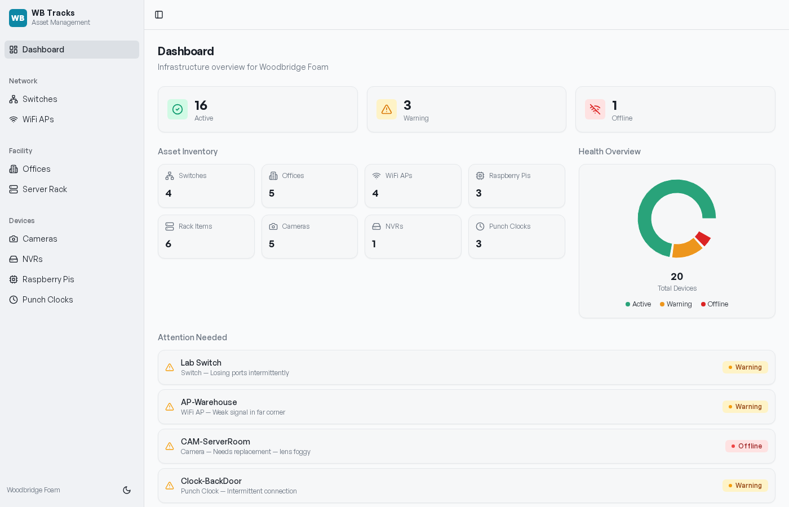
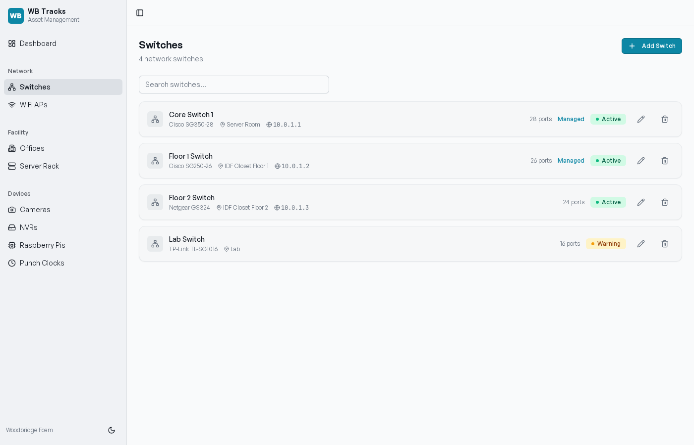
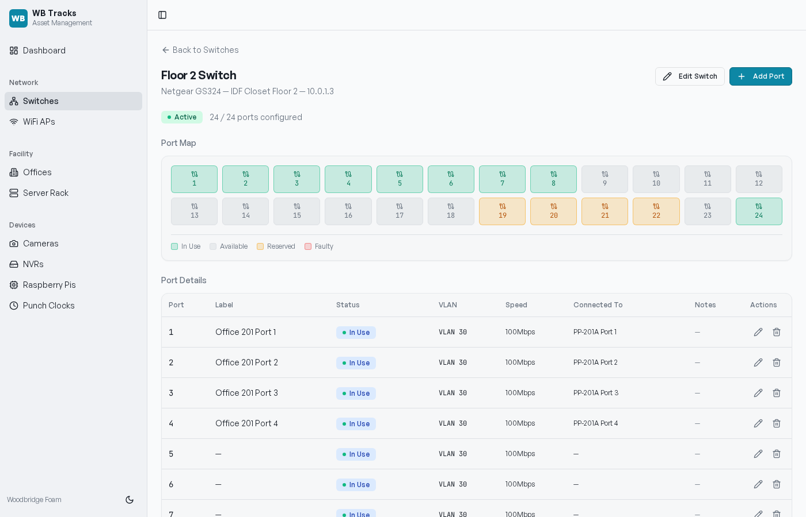
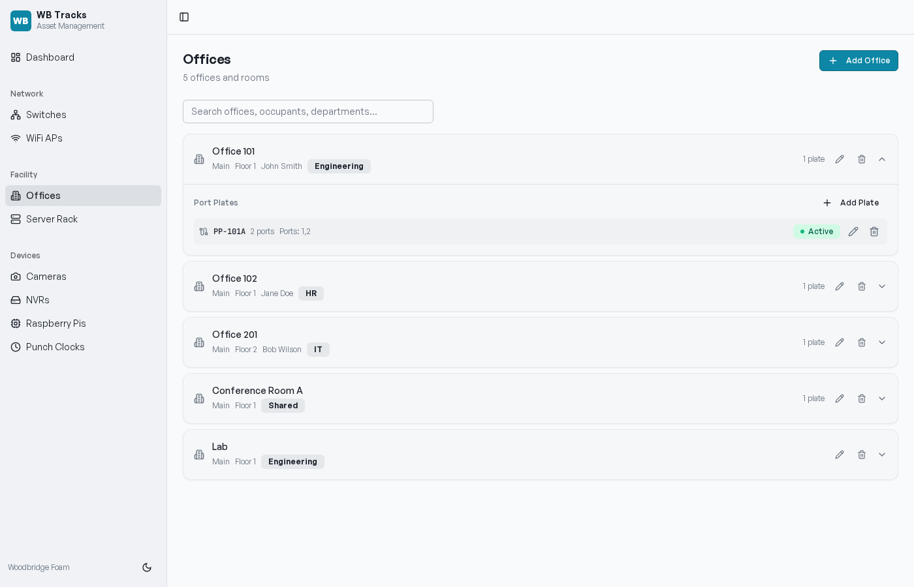
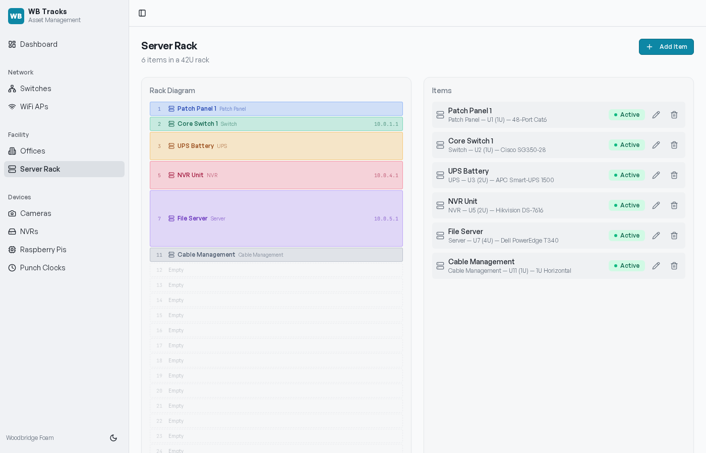
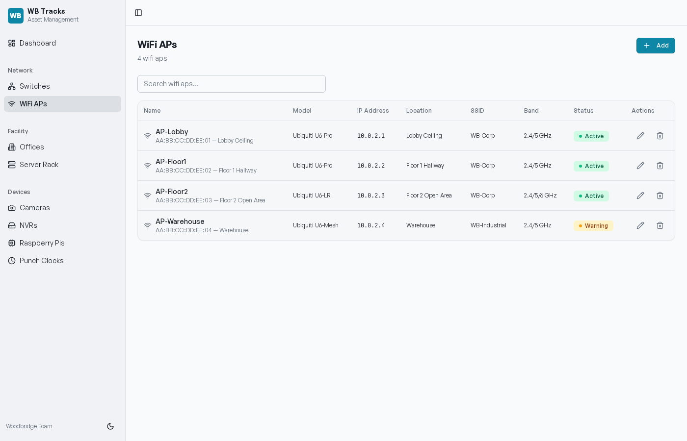
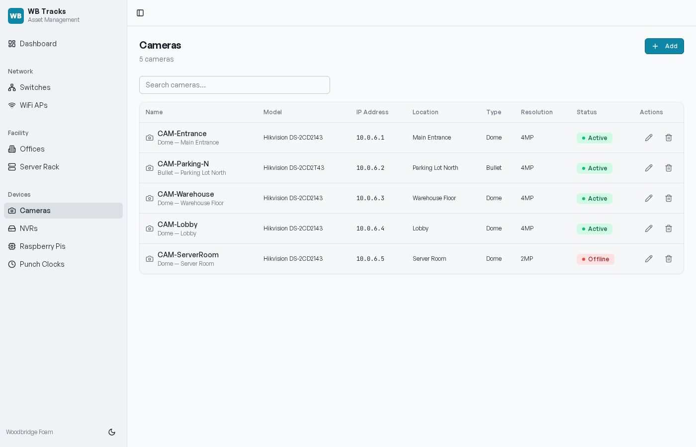

# WB Tracks

**IT asset management for Woodbridge Foam of Woodbridge Inc.**

A purpose-built tracking system for onsite IT and process engineering. Catalog every switch, port, wall plate, access point, camera, NVR, Raspberry Pi, punch clock, and rack item across the plant — from one place, on any device on the network.



---

## Why WB Tracks

Plant IT lives and dies by knowing what is plugged into what. WB Tracks replaces the spreadsheets, sticky notes, and tribal knowledge with a single source of truth:

- **Find the switch port behind any wall plate** in seconds
- **See port utilization** for every switch at a glance
- **Track every device** with IP, MAC, model, location, and notes
- **Spot problems early** with a dashboard that surfaces warnings and offline devices
- **Run it on a Pi** sitting in the server rack — no cloud, no monthly bill, no SaaS lock-in

---

## Feature Highlights

### Network

- **Switches** — Catalog every managed and unmanaged switch with model, IP, location, and total port count
- **Per-port tracking** — Label, status (in use / available / reserved / faulty), VLAN, speed, connected device, and notes for every port
- **Visual port map** — Color-coded grid showing port status at a glance
- **WiFi APs** — SSID, band, location, uplink switch & port, status

### Facility

- **Offices & rooms** — Occupant, department, building, floor
- **Port plates** — Wall plates with port count and switch port mapping
- **Server rack** — 42U visual rack diagram with item position, rack units consumed, and IP

### Devices

- **Cameras** — Model, IP, location, type (dome/bullet/PTZ), resolution, NVR channel
- **NVRs** — Channel count, storage capacity, IP, location
- **Raspberry Pis** — Model, OS version, purpose, IP, MAC, location
- **Punch clocks** — Serial number, connection type (Ethernet / WiFi / Cellular)

### Dashboard

- **KPI cards** — Active, Warning, Offline counts across all assets
- **Asset inventory** — Live counts per category
- **Health donut chart** — Device status mix
- **Attention Needed** — Items in Warning or Offline status surfaced automatically

### Quality of life

- **Full CRUD** on every entity with shadcn dialogs and React Hook Form validation
- **Dark mode** seeded from system preference
- **Hash-based routing** for kiosk-style deploys behind reverse proxies
- **Sub-100ms response times** on a Pi 4 — in-memory storage with sub-millisecond reads

---

## Screenshots

| Switches list | Switch detail |
| --- | --- |
|  |  |

| Offices with port plates | Server rack |
| --- | --- |
|  |  |

| WiFi APs | Cameras |
| --- | --- |
|  |  |

---

## Quick Start (local development)

Prerequisites: **Node.js 20+** and **npm**.

```bash
git clone https://github.com/lowlunk/WB-Tracks.git
cd WB-Tracks
npm install
npm run dev
```

Open <http://localhost:5000>.

The dev server runs Express + Vite on a single port with hot module reload. Seed data is loaded automatically on first boot so the dashboard is populated immediately.

---

## Production Deployment

WB Tracks ships as a single Node.js process — frontend bundled, backend API, and static assets all served on **port 5000**.

```bash
npm run build
NODE_ENV=production node dist/index.cjs
```

For Raspberry Pi deployment with a USB transfer, systemd auto-start, and a static LAN IP — see **[DEPLOY.md](DEPLOY.md)**.

---

## Tech Stack

| Layer | Choice |
| --- | --- |
| **Frontend** | React 18, TypeScript, Vite 7, Tailwind CSS v3, shadcn/ui, Radix primitives |
| **Routing** | wouter with hash-based history (`useHashLocation`) |
| **State / data** | TanStack Query v5, React Hook Form, Zod |
| **Charts** | Recharts |
| **Backend** | Express 5 on Node 20+ |
| **Validation** | drizzle-zod schemas shared between client and server |
| **Storage** | In-memory `IStorage` interface (drop-in replaceable with Postgres via Drizzle) |
| **Build** | esbuild for server, Vite for client, single `dist/` output |

---

## Repository Layout

```
WB-Tracks/
├── client/               # React frontend
│   ├── src/
│   │   ├── components/   # shadcn UI + app-specific components
│   │   ├── pages/        # Route pages (dashboard, switches, offices, etc.)
│   │   ├── hooks/        # use-toast, use-mobile
│   │   ├── lib/          # queryClient, utils
│   │   └── App.tsx       # Router and layout shell
│   └── index.html
├── server/               # Express backend
│   ├── index.ts          # Server entrypoint
│   ├── routes.ts         # REST API (all entities + /api/dashboard)
│   ├── storage.ts        # IStorage interface + in-memory implementation with seed data
│   └── vite.ts           # Dev-mode Vite middleware
├── shared/
│   └── schema.ts         # Drizzle tables + Zod insert schemas (single source of truth)
├── docs/                 # Documentation and screenshots
├── dist/                 # Build output (gitignored)
└── package.json
```

---

## Documentation

- **[DEPLOY.md](DEPLOY.md)** — Raspberry Pi deployment, USB transfer, systemd, network setup
- **[USER_GUIDE.md](USER_GUIDE.md)** — End-user manual for every screen
- **[DEVELOPMENT.md](DEVELOPMENT.md)** — Architecture, local dev, API reference, contributing
- **[CHANGELOG.md](CHANGELOG.md)** — Release history

---

## License

MIT — see [LICENSE](LICENSE).

Built by Chris Bryson for Woodbridge Foam of Woodbridge Inc.
