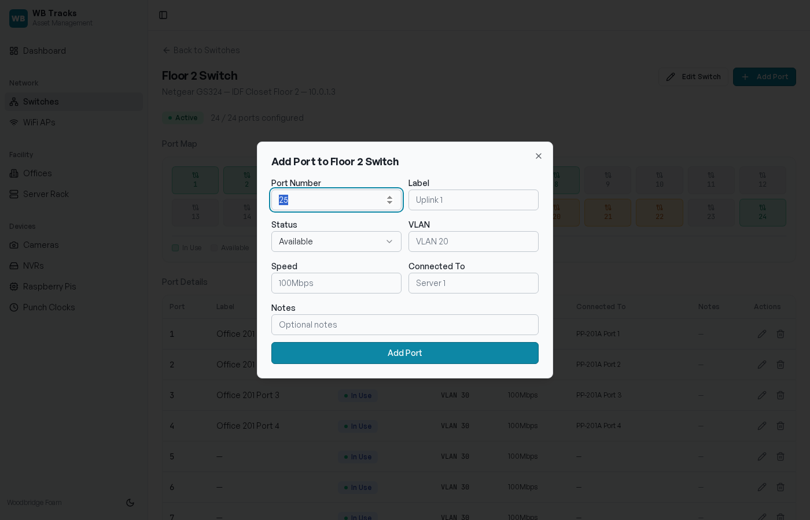
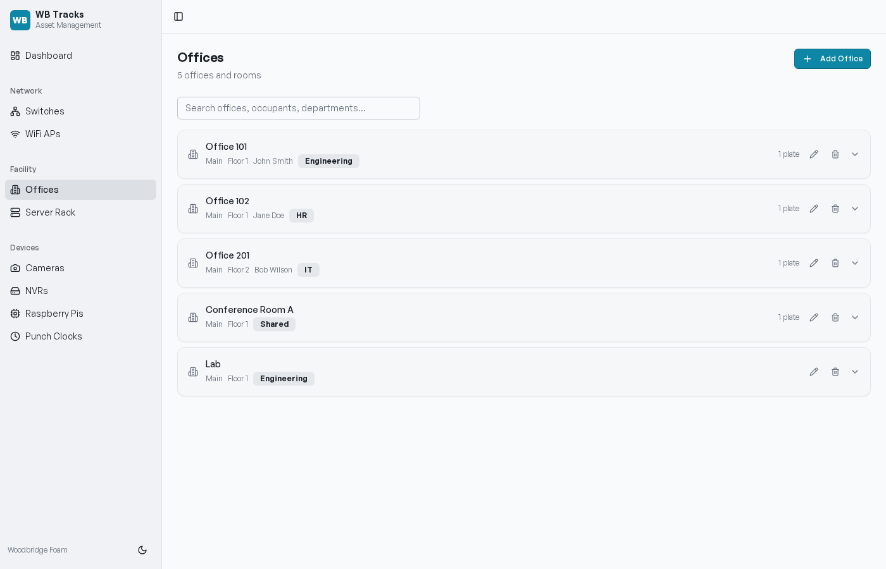
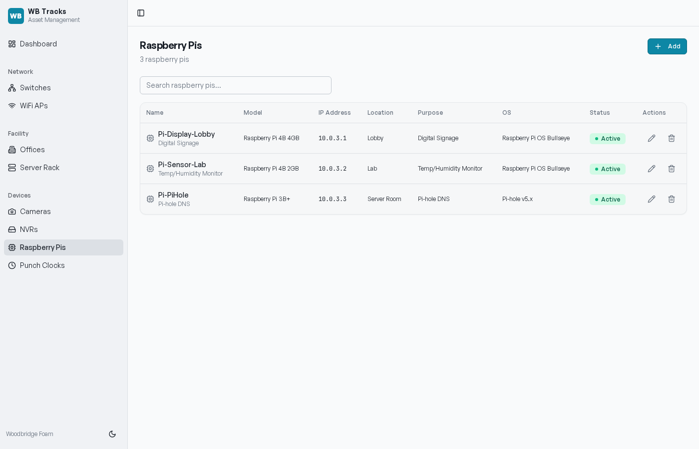
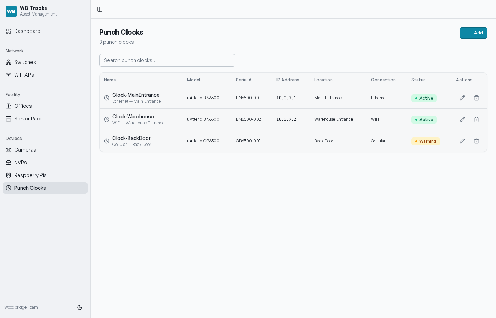
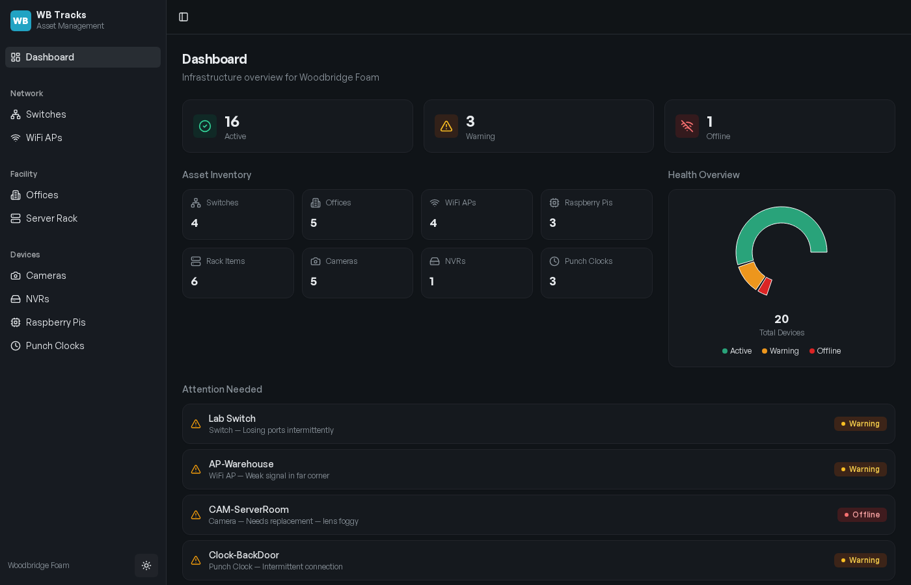

# User Guide

A complete walkthrough of every screen in WB Tracks. Written for the people who will use it day-to-day — onsite IT, process engineers, maintenance, and management.

---

## Getting In

Open a browser on any PC, laptop, or phone on the plant network and go to:

```
http://wbtracks/
```

(or `http://wbtracks.local/` / `http://10.0.0.50:5000/` depending on how IT set it up — see [DEPLOY.md](DEPLOY.md))

WB Tracks works on desktop, tablet, and phone. There is no login — anyone on the LAN can view and edit.

---

## The Sidebar

Every screen has the same left sidebar:

```
WB Tracks
─────────────
  Dashboard

Network
  Switches
  WiFi APs

Facility
  Offices
  Server Rack

Devices
  Cameras
  NVRs
  Raspberry Pis
  Punch Clocks
```

At the bottom, a **moon / sun icon** toggles dark mode. The choice follows your system preference by default.

---

## Dashboard


The landing screen. Use it as a daily status pulse.

### Top row — health KPIs

Three big counters across all asset types:

- **Active** (green) — everything is healthy
- **Warning** (amber) — something needs attention soon
- **Offline** (red) — completely down

### Asset Inventory

Live counts for each category: switches, offices, WiFi APs, Raspberry Pis, rack items, cameras, NVRs, punch clocks. Click through to that section's full list.

### Health Overview

A donut chart showing the mix of Active / Warning / Offline across every device. Center label shows total device count.

### Attention Needed

A live-filtered list of every asset in Warning or Offline status, sorted by severity. This is the **first thing to look at every morning**.

Click any item to jump to its detail page.

---

## Switches


The list of every network switch in the plant.

### Each row shows

- **Name** (e.g. "Floor 2 Switch")
- **Model** (e.g. "Cisco SG350-28")
- **Location** (e.g. "IDF Closet Floor 2")
- **IP address**
- **Total port count**
- **Managed / Unmanaged** badge
- **Status** — Active / Warning / Offline

### Actions per row

- **Click the row** → opens the **Switch Detail** page (see below)
- **Pencil icon** → edit switch metadata in a dialog
- **Trash icon** → delete the switch (confirmation prompt — also deletes all its ports)

### Top-right

- **Search** — filter by name, model, location, or IP
- **Add Switch** button — opens a dialog for a new switch

### Add / Edit Switch dialog

Fields:

| Field | Notes |
| --- | --- |
| Name | Required |
| Model | e.g. "Cisco SG350-28" |
| IP Address | e.g. "10.0.1.2" |
| Location | e.g. "IDF Closet Floor 1" |
| Total Ports | Defaults to 24 |
| Status | Active / Warning / Offline |
| Manageable | Toggle — affects management workflow |
| Notes | Free-form |

---

## Switch Detail


Click any switch to land here. This is where you map physical ports to what they're feeding.

### Header

Switch name, model, location, IP, status, and a **ports configured / total ports** counter (e.g. "24 / 24 ports configured").

Buttons on the right:

- **Edit Switch** — same dialog as the list page
- **Add Port** — see below

### Port Map

A color-coded grid of every port on the switch:

- **Green** — In Use
- **Gray** — Available
- **Amber** — Reserved (held for a future install)
- **Red** — Faulty

Hover or click a port square to see its details.

### Port Details table

Every port as a row:

| Column | Notes |
| --- | --- |
| Port | Number on the switch |
| Label | What you call it locally (e.g. "Office 201 Port 1") |
| Status | In Use / Available / Reserved / Faulty |
| VLAN | e.g. "VLAN 30" |
| Speed | e.g. "100Mbps", "1Gbps" |
| Connected To | What's plugged in (e.g. "PP-201A Port 1") |
| Notes | Free-form |
| Actions | Edit (pencil) / Delete (trash) |

### Add Port dialog



Click **Add Port** at the top-right. The dialog pre-fills the next available port number. Fill in label, status, VLAN, speed, connected-to, notes — and save.

### Edit Port dialog

Click the pencil icon on any port row. Same fields as Add, pre-populated.

### Common workflow — "Where does Office 207 plug in?"

1. Open the office (Facility → Offices → Office 207)
2. Read the port plate label and the connected switch / port
3. Done — no closet trip needed

### Common workflow — "I just patched a new run"

1. Switches → click the switch in the closet → **Add Port** if it's a new port number, or **Edit Port** if it was previously Available
2. Set status to **In Use**, fill in Label, Connected To
3. Save

---

## WiFi APs


Every wireless access point in the plant.

| Column | Notes |
| --- | --- |
| Name | e.g. "AP-Floor2" |
| Model | e.g. "Ubiquiti U6-LR" |
| MAC + location subtitle | physical identifier |
| IP Address | management IP |
| Location | where it's mounted |
| SSID | which network it broadcasts |
| Band | "2.4 GHz", "5 GHz", "2.4/5 GHz", "2.4/5/6 GHz" |
| Status | Active / Warning / Offline |

**Add / Edit dialog** also captures the upstream switch and switch port — so you can trace any AP back to its closet drop.

---

## Offices



Every office, room, and area in the facility — plus the wall ports inside each.

### Each row shows

- Office name
- Building / floor
- Occupant
- Department badge
- Port plate count

### Actions

- **Pencil** — edit office details
- **Trash** — delete (also removes port plates inside)
- **Chevron** — expand to see port plates

### Expanded view


Inside each office, you see every **port plate** (wall plate) — what it's labeled, how many ports it has, which switch & ports it's tied to, and its status.

Buttons:

- **Add Plate** — register a new wall plate
- **Pencil** on a plate — edit
- **Trash** on a plate — delete

### Port Plate dialog fields

| Field | Notes |
| --- | --- |
| Plate Label | e.g. "PP-201A" |
| Port Count | Usually 2 or 4 |
| Connected Switch | Dropdown of all known switches |
| Connected Ports | e.g. "1,2" or "5-8" |
| Status | Active / Warning / Offline |
| Notes | Free-form |

### Common workflow — "Add a new office that was just built"

1. Offices → **Add Office** → fill in name, building, floor, occupant, department
2. Expand the new office → **Add Plate** → label it, set the port count, link to the switch and ports
3. Open the linked switch → set those ports to **In Use** with a label that ties back to the office

---

## Server Rack


A visual representation of your 42U rack and what lives where.

### Left — Rack Diagram

Shaded blocks show each item's footprint (1U, 2U, 4U) at its position. Color-coded by status. Empty U positions show as faint stripes.

### Right — Items list

Every rack item as a card with edit / delete actions.

### Add / Edit Item dialog

| Field | Notes |
| --- | --- |
| Name | e.g. "Core Switch 1" |
| Type | Server / Switch / UPS / NVR / Patch Panel / Cable Management |
| Model | e.g. "Cisco SG350-28" |
| Rack Position | U number where it starts (1 = bottom) |
| Rack Units | How tall it is (default 1) |
| IP Address | If applicable |
| Status | Active / Warning / Offline |
| Notes | Free-form |

---

## Cameras


Every IP camera in the plant.

| Column | Notes |
| --- | --- |
| Name | e.g. "CAM-Entrance" |
| Type subtitle | "Dome — Main Entrance" |
| Model | e.g. "Hikvision DS-2CD2143" |
| IP Address | |
| Location | |
| Type | Dome / Bullet / PTZ / Turret |
| Resolution | "2MP", "4MP", "8MP / 4K" |
| Status | Active / Warning / Offline |

**Add / Edit dialog** also lets you link the camera to its NVR and channel number — so you can quickly find recordings.

---

## NVRs

The Network Video Recorders the cameras feed into.

| Column | Notes |
| --- | --- |
| Name | e.g. "NVR-Main" |
| Model | |
| IP Address | |
| Location | |
| Total Channels | Usually 16 or 32 |
| Storage Capacity | e.g. "8TB" |
| Status | |

---

## Raspberry Pis



Every Pi running on the plant — including the one running WB Tracks itself.

| Column | Notes |
| --- | --- |
| Name | |
| Model | "Pi 3B+", "Pi 4 4GB", "Pi 5" |
| IP Address | |
| MAC Address | |
| Location | |
| Purpose | What it does — "WB Tracks server", "Print server", "Time clock display", etc. |
| OS Version | "Bookworm 64-bit", etc. |
| Status | |

---

## Punch Clocks



Every time-clock / punch-clock terminal.

| Column | Notes |
| --- | --- |
| Name | |
| Model | e.g. "uAttend BN6500" |
| Serial # | |
| IP Address | (blank for cellular clocks) |
| Location | |
| Connection | Ethernet / WiFi / Cellular |
| Status | |

---

## Dark Mode



Click the moon / sun icon at the bottom of the sidebar to toggle. The default follows your OS setting. Helpful for control-room screens at night and for tired eyes.

---

## Tips & Shortcuts

- **Search is your friend.** Every list has a search box that filters across multiple fields (name, model, IP, location).
- **Status is the truth.** When something goes down, set it to **Warning** or **Offline** immediately — it'll show on the dashboard's Attention list and the next person on shift will see it.
- **Use Notes for tribal knowledge.** "Power cycles weekly", "Loaner from vendor", "RMA case #12345" — anything that would otherwise get lost on a Post-it.
- **Label everything physically.** WB Tracks is the digital twin of your plant. Use the same labels on the wall plate and in WB Tracks. Future-you and your replacement will thank you.

---

## Field Reference

### Status values (used across all entities)

| Value | When to use |
| --- | --- |
| **Active** | Healthy, in production |
| **Warning** | Intermittent issue, scheduled maintenance, RMA pending |
| **Offline** | Down, disconnected, not in service |
| **Reserved** _(ports only)_ | Held for a planned install — not in use yet |
| **Available** _(ports only)_ | Free, ready to be assigned |
| **Faulty** _(ports only)_ | Port itself is bad — do not use |

### Building / Floor conventions

We use **Main** as the building name and **1**, **2**, etc. as floor numbers. If we add more buildings later, name them clearly — "Warehouse", "Annex", etc.

---

## Frequently Asked

**Q: I deleted an office by accident. Can I undo?**
A: No — there is no undo. Recreate it. v1.0 trades simplicity for reversibility.

**Q: Why don't I see any changes I made yesterday?**
A: v1.0 uses in-memory storage, which resets to seed data on every server restart. Once IT migrates the Pi to Postgres (see [DEVELOPMENT.md](DEVELOPMENT.md#persistence)), edits will persist permanently. Until then, treat this as a working model and write changes down.

**Q: Can two people edit at the same time?**
A: Yes. Last write wins. If you both edit the same thing in the same minute, refresh after saving and check the value.

**Q: How do I export the data for a spreadsheet?**
A: Not in the UI yet — but the API returns JSON for everything (e.g. `curl http://wbtracks/api/switches`). See [DEVELOPMENT.md](DEVELOPMENT.md#api-reference) for the endpoint list. CSV export is on the roadmap.

**Q: I want a new field on a switch / camera / etc.**
A: Open an issue on the repo or ping Chris. Schema lives in `shared/schema.ts` — adding a field is a small change.

**Q: Can I print the rack diagram?**
A: Use your browser's Print → Save as PDF. Landscape works best.

---

## Reporting Bugs

If something breaks, capture:

1. What you clicked (steps to reproduce)
2. What you expected to happen
3. What actually happened
4. A screenshot if visual
5. The URL (so we know which entity)

File at <https://github.com/lowlunk/WB-Tracks/issues> or send to Chris directly.
